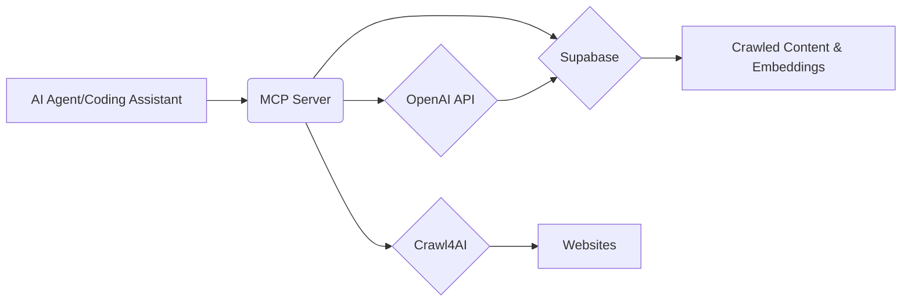

# System Overview: Crawl4AI RAG MCP Server

This document provides a comprehensive overview of the Crawl4AI RAG MCP Server, including its architecture, technical flow, and the tools and technologies used.

## 1. Architecture

The Crawl4AI RAG MCP Server follows a microservice architecture, acting as a central point for AI agents and coding assistants to access web crawling and RAG capabilities.



**Components:**

*   **AI Agent/Coding Assistant:** Interacts with the MCP server to request web crawling and RAG services.
*   **MCP Server:** The core component that exposes tools for web crawling and RAG. It orchestrates the interactions between Crawl4AI, Supabase, and OpenAI API.
*   **Crawl4AI:** A web crawling library used to extract content from websites. It supports different URL types (e.g., sitemaps, regular web pages).
*   **Supabase:** A database used to store the crawled content and perform vector similarity searches for RAG.
*   **OpenAI API:** Used to generate embeddings for the crawled content, enabling semantic search.

## 2. Technical Flow

The following diagram illustrates the technical flow of the Crawl4AI RAG MCP Server:

```mermaid
graph LR
    A[AI Agent Request] --> B{MCP Server};
    B -- Crawl Request --> C{Crawl4AI};
    C --> D[Website];
    D --> E{Content Extraction};
    E --> F{Content Chunking};
    F --> G{Embedding Generation (OpenAI)};
    G --> H{Supabase (Store Content & Embeddings)};
    I[AI Agent Query] --> B;
    B -- RAG Query --> J{Supabase (Vector Search)};
    J --> K[Relevant Content];
    K --> L{MCP Server};
    L --> M[AI Agent Response];
```

**Detailed Steps:**

1.  **Crawl Request:** An AI agent sends a request to the MCP server to crawl a specific URL.
2.  **MCP Server:** The MCP server receives the request and uses Crawl4AI to crawl the website.
3.  **Crawl4AI:** Crawl4AI extracts the content from the website.
4.  **Content Extraction:** The extracted content is processed to remove irrelevant information.
5.  **Content Chunking:** The content is split into smaller chunks for better RAG performance.
6.  **Embedding Generation (OpenAI):** OpenAI's API is used to generate embeddings for each content chunk.
7.  **Supabase (Store Content & Embeddings):** The content chunks and their embeddings are stored in Supabase.
8.  **RAG Query:** An AI agent sends a query to the MCP server to retrieve relevant information.
9.  **MCP Server:** The MCP server receives the query and uses Supabase to perform a vector similarity search.
10. **Supabase (Vector Search):** Supabase searches for content chunks that are semantically similar to the query.
11. **Relevant Content:** The relevant content chunks are retrieved from Supabase.
12. **MCP Server:** The MCP server formats the results and sends them back to the AI agent.
13. **AI Agent Response:** The AI agent receives the relevant content and uses it to generate a response.

## 3. Tools and Technologies

*   **Crawl4AI:**
    *   A flexible web crawling library that supports different URL types (regular webpages, sitemaps, text files).
    *   Used for extracting content from websites.
    *   Version: 0.6.2
*   **MCP (Model Context Protocol):**
    *   A protocol for communication between AI agents and servers.
    *   Used for exposing web crawling and RAG capabilities to AI agents.
    *   Version: 1.7.1
*   **Supabase:**
    *   A database that provides vector similarity search capabilities.
    *   Used for storing crawled content and performing RAG queries.
    *   Version: 2.15.1
*   **OpenAI API:**
    *   An API for generating embeddings.
    *   Used for creating embeddings for the crawled content, enabling semantic search.
    *   Version: 1.71.0
*   **Python:**
    *   The programming language used to implement the MCP server.
    *   Version: 3.12+
*   **uv:**
    *   A fast Python package installer and virtual environment manager.
    *   Used for managing the project dependencies.
*   **Docker:**
    *   A containerization platform.
    *   Used for packaging and deploying the MCP server.

## 4. MCP Server Tools

The MCP server provides the following tools:

*   `crawl_single_page`: Crawls a single web page and stores its content in Supabase.
*   `smart_crawl_url`: Intelligently crawls a URL based on its type (sitemap, txt file, or regular webpage).
*   `get_available_sources`: Gets a list of all available sources (domains) in the database.
*   `perform_rag_query`: Performs a RAG query on the stored content.
